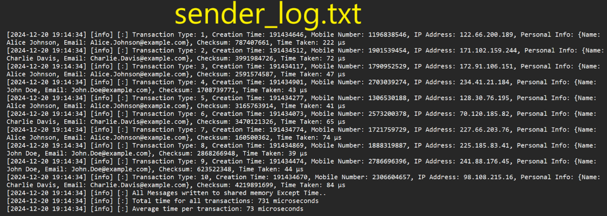

---

# RMQ_TransactionBundler

## Project Description
The **RMQ_TransactionBundler** project is designed to handle writing data into shared memory, while ensuring data integrity and configurability. It bundles the messages read from shared memory and transmits them to RabbitMQ (RMQ) in a structured format. Configurable parameters like bundle size, timeout, and local dumping for debugging enhance its flexibility.

---

## Technology and Frameworks Used
- **C++17**: Core programming language.
- **Boost Libraries**: For shared memory management, containers, and CRC computation.
- **RabbitMQ**: Message queuing and handling.
- **spdlog**: Logging.
- **CMake**: Build configuration.

---

## Project Structure
```plaintext
.
├── CMakeLists.txt
├── README.md
├── build
│   ├── dumppp.csv
│   ├── log
│   │   ├── receiver_log.txt
│   │   └── sender_log.txt
│   ├── receiver
│   └── sender
├── common
│   ├── include
│   │   ├── config.h
│   │   └── logger.h
│   └── src
│       ├── config.cpp
│       └── logger.cpp
├── config
│   └── values.config
├── lib
│   ├── Boost_Headers
│   ├── Boost_Libraries
│   ├── nlohmann_Json_Header
│   ├── RabbitMQ_Headers
│   ├── RabbitMQ_Libraries
│   ├── spdlog
│   └── spdlog_Libraries
├── messageclass
│   └── src
│       └── UserMessages_Data.h
├── receiver
│   └── src
│       └── receiver.cpp
└── sender
    └── src
        └── sender.cpp
```

---

## Project Images

<br><br>
<br><br>
<br><br>
<br><br>
<br><br>
<br><br>

---

## Steps to Run the Project
1. **Clone the Repository**:
   ```bash
   git clone <repository-url>
   cd <repository-directory>
   ```

2. **Build the Project**:
   ```bash
   mkdir build
   cd build
   cmake ..
   make
   ```

3. **Configure the Project**:
   - Edit the `config/values.config` file to set desired configuration values.

4. **Run the Sender**:
   ```bash
   ./sender
   ```

5. **Run the Receiver**:
   ```bash
   ./receiver
   ```

---

## Technical Details

### Functions and Their Purpose

**Sender.cpp**
- `generate_random_mobile_number()`: Generates a random 10-digit mobile number.
- `generate_random_ip_address()`: Generates a random IP address.
- `generate_random_creation_time()`: Generates a random creation time in HHMMSSMilliseconds format.
- `generate_random_name()`: Generates a random name from a predefined list.
- `generate_random_email(const std::string& name)`: Generates a random email based on the provided name.
- `compute_crc(const UserMessagesData& msg)`: Computes the CRC checksum for a message.
- `log_transaction_times(const std::vector& times)`: Logs total and average transaction times.
- `main()`: Initializes shared memory, generates messages, computes checksums, and logs transaction details.

**Receiver.cpp**
- `compute_crc(const UserMessagesData& msg)`: Computes the CRC checksum for a message.
- `log_read_times(const std::vector& times)`: Logs total and average read times.
- `send_to_rabbitmq(const std::vector& messages, const std::string& queue_name, const std::string& max_bundle_size_allowed)`: Sends message bundles to RabbitMQ.
- `read_and_log_messages(bip::managed_shared_memory& segment, std::vector& read_times, size_t& last_processed_index, std::vector& message_bundle)`: Reads messages from shared memory, verifies checksums, and logs read times.
- `dump_to_csv(const std::vector& messages, const std::string& filename)`: Dumps messages to a CSV file for debugging.
- `main()`: Initializes shared memory, reads messages, sends bundles to RabbitMQ, and logs details.

---

## Configuration File (`values.config`)
The configuration file includes:
- `LOGGER_LEVEL_SETT`: Logging level (e.g., info, debug).
- `DATA_BULK_COUNT`: Number of messages generated in bulk.
- `NAME_SHARED_MEMORY`: Shared memory segment name.
- `SHARED_MEMORY_SIZE`: Size of the shared memory segment.
- `LOG_TIMER_RECEIVER`: Logging interval in the receiver.
- `NAME_RABBITMQ`: RabbitMQ queue name.
- `DEBUGGING_MODE`: Enable/disable debugging (true/false).
- `DUMP_CSV_FILE_NAME`: CSV file name for dumping messages.
- `BUNDLE_SIZE`: Maximum size of a message bundle.

---

## Goals and What I Learned

### Goals
- Ensure data integrity through CRC checksums.
- Efficiently bundle and send messages to RabbitMQ.
- Provide configurability for debugging and optimization.

### What I Learned
- Using Boost for shared memory management and CRC computation.
- Integrating RabbitMQ for message queuing.
- Logging with spdlog.
- Building a project using CMake.

--- 

